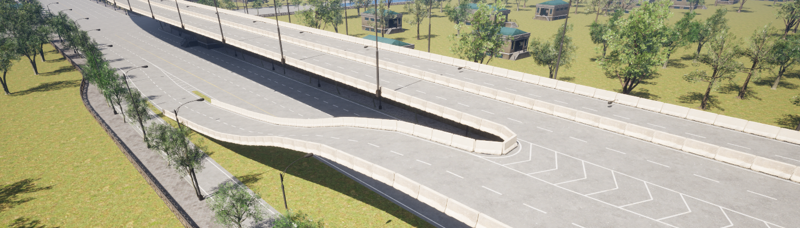

# RoadBuilder

RoadBuilder is a plugin for UnrealEngine that helps you to make complex roads in Unreal Editor.

RoadBuilder allows you to edit every detail of your road, including lane type, width, lane markings, traffic signs, zebra crossings, and more, while its built-in road styles allow you to quickly create various types of roads, such as street, highway, ramps, elevated roads and tunnels.

RoadBuilder can also create ground meshes and boundary spline for PCG system to generate more detail.

The roads created by RoadBuilder can be exported to OpenDrive format for use in various autonomous driving simulation environments.

### Features

- Spiral and curvature blending supported road planning.
- Various built-in road styles (street, highway, elevated, tunnel) and corresponding road props generation.
- Road chopping and splitting
- Junctions, ramps and forks generation.
- Lane carving and offset adjustment.
- Various lane marking and traffic signs support.
- Gore area generation.
- Seamless and refined ground mesh generation along with spline boundary for PCG graph
- SVG file import.
- OpenDrive (xodr) format export.

### Video tutorials

- https://www.youtube.com/watch?v=zGpPd4RAneQ&list=PLCWhWOgVmdwkOBGElYEPumnCXL12zEtwE